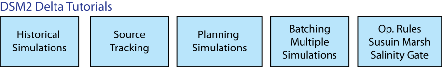

# An Introduction to DSM2 Tutorials

**DSM2 Website**
<http://baydeltaoffice.water.ca.gov/modeling/deltamodeling/deltaevaluation.cfm>  
**Documentation**  
If DSM2 is installed on your computer, clicking on the START menu and
select *Programs*  *DSM2_v8*  *DSM2_documentation*

# Introduction

Welcome to the Delta Simulation Model 2 (*DSM2)* *Version 8 tutorial*.
The tutorial is divided into two sets of lessons. The first set teaches
basic DSM2 skills using simplified channels. The second set of tutorials
explores more advanced DSM2 skills using the model application to the
Sacramento-San Joaquin Delta. The input files for these tutorials are in
the *tutorial\\simple* and *tutorial\\historical* directories
respectively.  
The goal of the beginning tutorials (BasicTutorials 1-6, see Figure 1)
is to familiarize you with the DSM2 input system and fundamental
modeling capabilities. This six-part tutorial builds a model of a simple
channel system, with each part building in complexity from its
predecessor. It is recommended that the tutorials be completed in order,
but it is not necessary since the tutorials are self contained.  
  
**Figure 1: DSM2 Basic Tutorials**  
The goal of the Delta tutorials (DeltaTutorials 1-5, see Figure 2) is to
familiarize you with Delta specific DSM2 applications and tasks. In
addition a DSM2 Overview document has been provided that describes the
DSM2 modules (HYDRO, QUAL, and PTM) and their typical modes of
application (historical, real-time and planning).  
  
**Figure 2: DSM2 Delta Tutorials**  
***{DSM2_home}***  
In working the tutorials, the directory where you installed DSM2 will be
referred to as *{DSM2_home}*. E.g., if you accepted the default install
directory, *{DSM2_home}* would be *d:\\delta\\dsm2* (there may also be a
version number in the directory name).  
The first tutorial is called *Channels*, and involves setting up the
channel grid, adding parameters, setting boundary conditions, and
listing output locations. The second tutorial is called *Reservoir Gate
Transfer*, and involves adding these components to the simple channel
system.  
The third tutorial is called *Layering*. The section guides you through
the nuances of organizing data in multiple files. Layers are part of the
DSM2 data management system. They allow input items to be grouped in
logical bundles, and allow changes to be brought into an old simulation
without erasing or altering archived items.  
The fourth tutorial is called *Timevar*, and demonstrates the addition
of time-varying information to the model. In the previous sections, all
boundary conditions and gate timings were set as constant, and no input
files were needed. In this section, the model is set to read
time-varying information stored in DSS files.  
The fifth tutorial is called *Output*, and covers advanced output
options. The first part involves modifications to the text input file,
*hydro.inp*. The second part describes the use of *groups* and source
tracking in QUAL.  
The sixth tutorial is called *Oprule*, and covers the use of Operating
Rule Language (ORL) statements to set gate operations. In the previous
versions of DSM2, the input text and time series files had to explicitly
state the operations of gates. With the operating rules, expressions can
be used to make the model operate gates on-the-fly. E.g., a gate can be
directed to automatically close when salinity conditions reach a certain
threshold.  
There are two icons that are used to highlight information in the
tutorials.  

Indicates a DSM2 "gotcha" moment in which extra care may be necessary.  

Indicates a question to put your new found DSM2 knowledge to the test.

## Attachments:

[worddavf9e3aa73957a24bdb115e43494948841.png](attachments/8323216/8323217.png)
(image/png)  

[worddave8e1df4e853bb46c4ee6f68afece040d.png](attachments/8323216/8323218.png)
(image/png)  

[worddav60051e935447589caefd1f91c8321714.png](attachments/8323216/8323219.png)
(image/png)  

[worddavefcb05a5de66d3bbb80de43fc104db25.png](attachments/8323216/8323220.png)
(image/png)  

