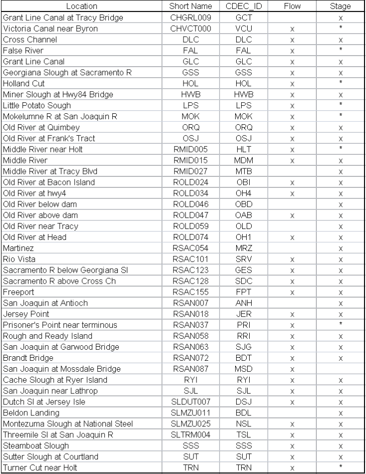
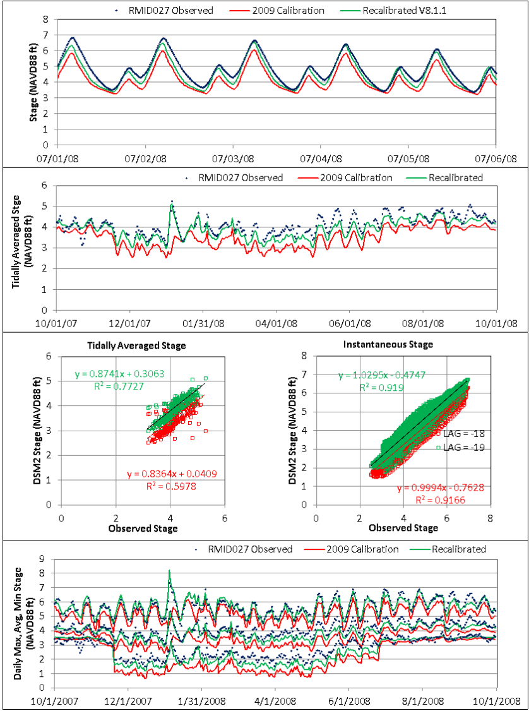
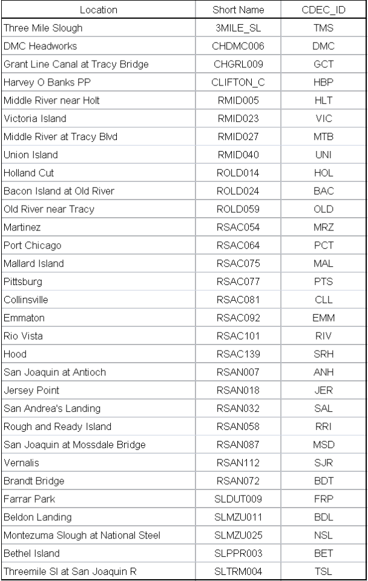
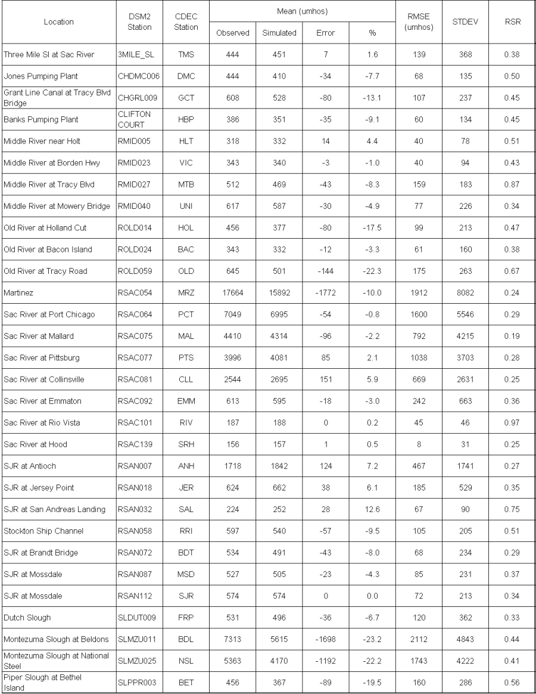
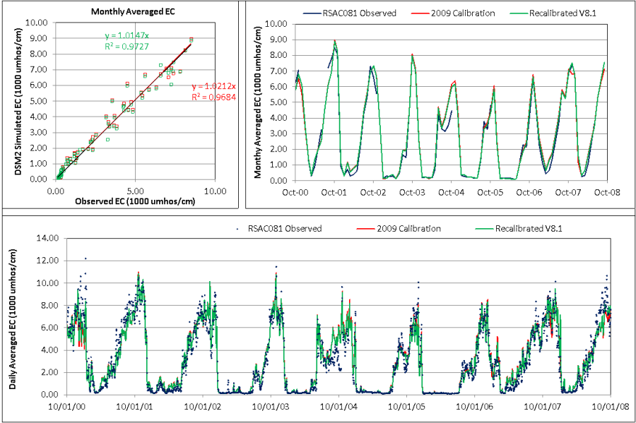
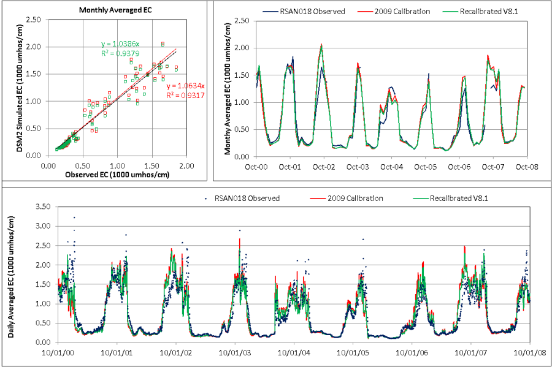

# Calibration Memo

Date: 9-3-2013   
To: Tara Smith   
From: Lianwu Liu  
Prabhjot Sandhu  
Delta Modeling Section  
Bay-Delta Office  
Department of Water Resources   
Subject: DSM2 Version 8.1 Calibration with NAVD88 datum

## Introduction

A new calibration has been performed for Version 8.1 of DSM2. Version
8.1 incorporates latest improvements to DSM2 code. The main differences
in DSM2 version 8.1 include: DSM2-Qual model formulation change to
improve model convergence (presented at CWEMF 2011 conference and
discussed in (Liu & Ateljevich, Improvements to DSM2-Qual: Part
1,2011)); modifications to the DSM2-Hydro program source code that
improve channel geometry calculation (presented at CWEMF 2012 conference
and documented in (Liu & Ateljevich, Improved Geometry Interpolation in
DSM2-Hydro, 2012)); datum conversion to NAVD88; and Martinez EC boundary
correction. Since these changes affect results both in DSM2 Hydro and
Qual, a new calibration is needed. This calibration is done by adjusting
Manning's coefficient values in Hydro and dispersion coefficients in
Qual. Some channel cross sections were corrected. Further improvements
involving other changes, e.g. new bathymetry and grid change, may come
in future releases.

  

Detailed documentation is available as [pdf
attachments](#CalibrationMemo-attachments).

  

## Hydrodynamics Calibration

This calibration is based on the 2009 BDCP Calibration grid (often
referred to as mini-calibration, CH2M Hill, October 2009), and converted
to NAVD88. CDEC has been reporting stage data in NAVD88 since 2006.
Before then, although stage stations were reported using a common datum
(NGVD 1929), in fact individual stage stations had different, unknown
local datums. It should be more accurate to use NAVD88 and convenient
for comparing stage with observed data. Minor changes were made to some
channels and cross sections, e.g. channel 141, 144 were corrected. Some
cross sections having negative conveyance gradient (dConveyance) were
modified. Some corrections were made to Martinez stage and Clifton Court
Gate operation data.   
Sensitivity tests of model and tidefile time steps were done; the time
steps chosen for this calibration were 15, 30, 15 minutes for Hydro, the
tidefile, and Qual, respectively (the tidefile is output by Hydro and
contains hydrodynamic data for use in Qual).   
  
The Hydro calibration period was from 10/1/2001 to 10/1/2002 and
10/1/2007 to 10/1/2008, and validation periods from 10/1/2006 to
10/1/2007 and 10/1/2009 to 10/1/2009. The calibration stations are
listed in Table 1 and shown in Figure 1.   
  
**Table 1 Hydrodynamics Calibration Locations**   
  
\*Datum inconsistency at some stations not resolved.   
 **Figure
1** **Hydro Calibration Stations**   
The model was primarily calibrated to match observed flows. Manning's
coefficient values were adjusted for Hydro calibration. Stage was also
compared to observed data in the same format as flow comparison. The
calibration metrics are composed of five figures for each station: 

-   **Timeseries comparison of instantaneous flow.** This plot compares
    modeled and observed instantaneous flow. We show only 5 days in
    order to be able to see the tidal process and comparison clearly.
-   **Timeseries comparison of tidally-filtered daily-averaged
    flow.** This plot compares modeled and observed tidally averaged
    flow, or net flow. Net flow is critical for flow distribution and
    for salt transport.
-   **Linear regression analysis of tidally-filtered daily-averaged
    flow.** This scatter plot with a linear regression trend line shows
    statistically the comparison of the simulated vs. observed daily
    averaged flow. R2 value gives information about the
    goodness of fit of the model. The trend line shows over- or
    under-predicting of the model.
-   **Linear regression analysis of instantaneous flow.** This analysis
    followed a similar procedure described in the "Flooded Islands
    Pre-Feasibility Study" report (RMA 2005). The phase difference
    between the modeled and measured time series was determined using a
    cross-correlation procedure, and the modeled time series was shifted
    with the calculated phase lag before doing the regression analysis.
    The phase difference is noted in the figure. A positive value
    indicates that the simulated tidal process lags behind the observed
    record, while a negative value indicates a faster response by the
    model. The slope of the regression line approximates the amplitude
    ratio for modeled vs. observed tidal process. R2 value
    gives information about the goodness of fit of the model. This plot
    was generated using data from 5/15/2008 to 7/15/2008. This short
    period of low flow was selected to better represent the tidal
    process. It is difficult to use the whole calibration period since
    high flow periods may have bigger net flow errors, which may be
    difficult to portray in a figure.
-   **Daily Maximum, Average, Minimum comparison.** This plot compares
    modeled and observed daily maximum, average, minimum flow over the
    entire calibration period. It is easy to see how the model is doing
    overall in the entire calibration period.

  
Since overall the calibrated flow in 2009 BDCP Calibration matched
observed data reasonably well, the 2009 calibration was used as a
reference. Manning's n values were adjusted by groups. 26
adjustments/runs were made to reach the satisfactory result.   
Due to the bug fixes of channel area interpolation, Manning's n values
changed significantly in some areas, as summarized in Table 2. For
example, in Steamboat Slough, Manning's n changed from 0.024 to 0.029;
Lower San Joaquin River channels 48 to 51 changed from 0.022 to 0.026;
Montezuma Slough area changed from 0.018 to 0.021.   
**Table 2** **Recalibrated Manning's Coefficient**   
   
  
Flow results at a few locations are shown in Figures 2 to 7. In summary,
stations in the North Delta showed moderately improved results comparing
to 2009 BDCP Calibration, e.g. Rio Vista, RSAC123 (Figure 2 to 3).
Stations in the South Delta showed little or no improvements, e.g.
ROLD024 (Figure 4). A few stations showed dramatic improvements, i.e.
RSAN087, LPS, DLC (Figure 5 to 7). The flow coefficients of the Delta
Cross Channel gate were changed to 2.0, to allow enough flow through the
gate.   
Stage comparisons at a few selected stations, i.e. CHGRL009, RMID027 and
DLC, are shown in Figure 8 to Figure 10. Simulated stages in this
calibration compared with field data much better than the 2009
calibration results, mainly due to the conversion to NAVD88. Maximum
stages in tidal cycles match much better with field record. Minimum
stages tend to be lower than observed data (e.g. Delta Cross Channel
Figure 10), as a result, simulated tidal ranges tend to be larger than
field data.   
  
  
  
  
**Figure 2** **Sacramento River at Rio Vista**  
  
**Figure 3** **Sacramento River downstream of Georgiana Slough**  
  
**Figure 4 Old River at Bacon Island**  
  
**Figure 5** **San Joaquin River at Mossdale**  
  
**Figure 6** **Little Potato Slough**  
   
**Figure 7** **Delta Cross Channel**   
   
**Figure 8** **Stage at Grant Line Canal**  
  
**Figure 9** **Stage at Middle River at Tracy Blvd**  
   
**Figure 10** **Stage at Delta Cross Channel**

## EC Calibration

Version 8.1 improved the dispersion formulation for model
convergence(Liu & Ateljevich, Improvements to DSM2-Qual: Part 1,2011) A
new dispersion coefficient (DC) was introduced. The calibration period
was from 10/1/2000 to 10/1/2008. We try to use all the stations with
good data. The calibration stations are listed in Table 3, and shown on
the map (Figure 11). Most of the data were downloaded from CDEC, and
went through limited QC to get rid of bad data points.   
Some corrections were made for Martinez boundary EC. It was found,
before 10/1/2002, the data were from IEP, they were indeed hourly
averaged data. But after 10/1/2002, CDEC hourly data were used, which
were instant samples, not hourly averaged. They were converted to hourly
averaged values using HEC-DSSVue (US Army Corps of Engineers, Hydrologic
Engineering Center), and the property was changed to **PER-AVER**. It is
recommended to always use **PER-AVER** data at boundaries for Qual. It
is more accurate for Qual to take **PER-AVER** data at boundaries
because of its explicit nature of the numerical scheme. A sensitivity
test showed that the differences between using 15min data and 1hour data
for Martinez boundary were around 0.1% in the Delta, which is
insignificant, so we used hourly-averaged data for Martinez EC in this
calibration. In the 2009 calibration, the Martinez boundary EC was
marked as hourly instantaneous data (property as INST-VAL in HEC-DSS)
with an inconsistent interpolation method as 'Last', this will cause EC
at Martinez boundary to be low. In V8.1 calibration, hourly-averaged EC
at Martinez was used with a correct interpolation method as 'Last'.   
The metrics used to evaluate model performance include:

-   **Linear regression analysis of monthly-averaged EC.** This scatter
    plot with a linear regression trend line shows the simulated vs.
    observed monthly averaged EC. The intercept is set to zero so that
    the slope shows the bias of the model for higher EC. The model is
    overpredicting when the slope is higher than 1, and underpredicting
    when the slope is smaller than 1. R2 value gives
    information about the goodness of fit of the model. A high
    R2 value close to 1 means best fit, which usually means
    high quality data and good model prediction.
-   **Timeseries comparison of monthly-averaged EC.** This plot compares
    modeled and observed EC month by month, easy to see directly which
    months the model is doing well or bad.
-   **Timeseries comparison of daily-averaged EC.** This plot compares
    modeled and observed EC on a daily basis, making it easier to see
    how the model is doing over all.
-   **Mean Error (ME) and Percent Mean Error(PME).** The mean values of
    observed and modeled EC for the entire calibration period are
    calculated. Percent Mean Error is calculated using Mean Error
    divided by the observed mean. This gives a normalized percentage how
    much the model is overpredicting or underpredicting.
-   **Root Mean Squared Error (RMSE) and Relative RMSE.** RMSE is
    calculated based on daily averaged data. It is a good indicator of
    model prediction error and representative of the size of a "typical"
    error. Originally, we proposed the relative RMSE (also called
    normalized RMSE, or percent RMSE) calculated as RMSE divided by the
    range of the data and expressed in percentage. A more mathematically
    sound parameter called RMSE-observed standard deviation ratio (RSR)
    may give a better scaling/normalization, so we changed to RSR
    (Moriasi et. al. 2007). It was recommended to be satisfactory for
    RSR≤0.70 for watershed models with a monthly time step, and very
    good for RSR≤0.5, while Percent bias(PBIAS, same as PME) is also
    satisfactory.

  
  
**Table 3** **EC Calibration Stations**  
   
  
**Figure 11 EC Comparison Stations**   
The calibration started by scaling the 2009 BDCP calibration dispersion
coefficients by 1200, i.e. *DC=DQQ x 1200*, where *DQQ* is the old
dispersion coefficient, since previous experience showed this approach
gave reasonable results. Then we calibrated the coefficients in groups
from the West Delta to the South Delta in the trial runs. 11 adjustments
and runs were taken to reach the satisfactory results, as described in
the calibration notes.   
30 stations with good data were selected and plotted. Mean Error,
Percent Mean Error, RMSE and RSR are calculated and listed in Table 4
(the same metrics were calculated for 2009 calibration run and listed in
Table 5 for comparison). Figure 12 through Figure 17 show the
calibration metrics plots (including the 2009 calibration results for
comparison) at key stations: Collinsville, Emmaton, Jersey Point, Old
River at Bacon Island, Clifton Court Forebay, and Montezuma Slough at
Beldons. Some outlier data points for monthly EC were taken out for
regression analysis, including December 2000, 2002, 2003, 2004, 2005,
and January 2001, when the model failed to predict the EC peaks, as seen
in the daily plots of Figure 15 and Figure 16. The reasons for these
missing peaks are not clear. By taking out these outliers, the
statistical analyses are more meaningful and represent the model
performance in other months better.   
From Table 4, key stations including Collinsville, Emmaton, Antioch,
Jersey Point, and Old River at Bacon Island have the smallest Percent
Mean Errors(PME) within 5% and RSR values less than 0.5, which are
better comparing to that of the 2009 calibration. The model consistently
under-predicts San Joaquin River stations (RSAN072, RSAN058) and South
Delta stations (ROLD059, CHGRL009, RMID027, CLIFTON COURT), where the
PMEs are larger than -10%. The worst is Old River at Tracy Road
(ROLD059) with percent mean error -22%. The RSR values of most of the
stations are less or close to 0.5 except RMID027, ROLD059, RSAC101, and
RSAN032, which may need to be further investigated. The predicted EC at
Montezuma Slough stations (SLMZU011, SLMZU025) are much lower than
observed, although the predicted EC matches the timing of salinity
intrusion well. These biases are similar to the 2000, 2009
calibrations.   
Figure 18 shows Martinez EC comparison was improved compared to the 2009
calibration as a result of correction of the Martinez boundary EC input
data.   
A lot of reasons might contribute to the errors in predicted EC, e.g.
bathymetry, DICU, boundary flow and water quality measurement errors,
over-simplification of the model formulation, etc. A 1D model such as
DSM2 may be inadequate to accurately model areas that are highly two
dimensional(e.g. shallow bays, such as Grizzly Bay, Suisun Bay, Franks
Tract ) or three dimensional (e.g. stratification in West Delta).
Further investigations are needed to improve the model calibration.   
  
**Table 4 Summary of Error Estimates at Selected Stations**  
  
**Table 5 Summary of Error Estimates Calculated for 2009
Calibration**   
   
  
**Figure 12** Sacramento River at Collinsville (RSAC081)  
  
**Figure 13** **Sacramento River at Emmaton (RSAC092)**  
  
**Figure 14** **San Joaquin River at Jersey Point (RSAN018)**  
  
**Figure 15** **Old River at Bacon Island
(ROLD024)**   
**Figure 16** **Clifton Court Forebay**   
  
**Figure 17** **Montezuma Sl at Beldons (SLMZU011)**  
  
**Figure 18 Martinez Boundary**   
**Summary**  
DSM2 Version 8.1 incorporates latest improvements to DSM2 code and a new
calibration with NAVD88 datum. The modifications of channel geometry
interpolation and dispersion formulation in Version 8.1 improved the
model reliability and convergence. Mass conservation was checked for
both Hydro and Qual. Sensitivity and convergence tests were done to
determine appropriate time steps to use. The conversion to NAVD88 stage
datum improved the comparison of predicted and observed stages in the
Delta. Errors in Clifton Court Gate operation data, Martinez stage data,
and Martinez EC data were corrected.   
The model predicted EC at key stations in Central Delta fairly well
(Collinsville, Emmaton, Antioch, Jersey Point). The new calibrated model
results are generally very close to the 2009 BDCP calibration results,
although there are significant changes of Manning's n values and
dispersion coefficients. Improvements were seen in a few places in Hydro
and Qual, but not as big as we hoped. Flow around Franks Tract area and
EC at the South Delta are the most desirable to be improved.   
This calibration was done mainly by adjusting Manning's coefficient and
dispersion coefficient values. Further improvements would involve bigger
changes, e.g. improve the channel schematic, regenerate cross sections
based on better bathymetry data, improve flow around Franks Track area,
improved estimates of diversions, return flows, and return flow water
quality, Clifton Court gate modeling improvement, etc.

## Acknowledgement

We would like to acknowledge Ralph Finch (DWR) for providing quality
controlled data for the calibration, Lan Liang (DWR) for updating the
historical run to 2012 and corrections made to Martinez stage and
Clifton Court Gate operation data, Qiang Shu for help with vtools and
some of the scripts used in the data analysis, and Parviz Nader-Tehrani
for valuable suggestions. 

## Reference

  
CH2M Hill. (2009 Oct). *DSM2 Recalibration.* Sacramento, CA: Prepared
for the California Department of Water  
Resources.   
Liu, L., Ateljevich, E. (2011). Improvements to DSM2-Qual: Part 1
(Chapter 1). In *Methodology for Flow and Salinity Estimates in the
Sacramento-San Joaquin Delta and Suisun Marsh: 32nd Annual Progress
Report.*Sacramento: California Department of Water Resources, Bay-Delta
Office, Delta Modeling Section.   
Liu, L., & Sandhu, P. (2011). Improvements to DSM2-Qual: Part 2 (Chapter
2). In *Methodology for Flow and Salinity Estimates in the
Sacramento-San Joaquin Delta and Suisun Marsh: 32nd Annual Progress
Report.*Sacramento: California Department of Water Resources, Bay-Delta
Office, Delta Modeling Section.   
Liu, L., & Sandhu, N. (2011 Aug). Dispersion Recalibration with DSM2
Version 8.1.1. *DSM2 Users Group Newsletter*. Sacramento: California
Department of Water Resources, Delta Modeling Section.   
Liu, L., Ateljevich, E., & Sandhu, P. (2012). Improved Geometry
Interpolation in DSM2-Hydro (Chapter 2). In  
*Methodology for Flow and Salinity Estimates in the Sacramento-San
Joaquin Delta and Suisun Marsh: 33rd Annual Progress
Report.* Sacramento: California Department of Water Resources, Bay-Delta
Office, Delta Modeling Section.   
Liu, L., & Sandhu, P. (2012). DSM2 Version 8.1 Recalibration (Chapter
3). In *Methodology for Flow and Salinity Estimates in the
Sacramento-San Joaquin Delta and Suisun Marsh: 33rd Annual
Progress Report.* Sacramento: California Department of Water Resources,
Bay-Delta Office, Delta Modeling Section.   
Moriasi, D.N., J.G. Arnold, M.W. Van Liew, R.L. Bingner, R.D. Harmel,
T.L. Veith. (2007). Model Evaluation Guidelines for Systematic
Quantification of Accuracy in Watershed Simulations. Transactions of the
ASABE. Vol.50(3):885-900.   
Resource Management Associates (RMA 2005). Flooded Islands
Pre-Feasibility Study: RMA Delta Model Calibration Report, prepared for
CA Department of Water Resources for submittal to California Bay-Delta
Authority, June 30. 

<a href="/pages/downloadallattachments.action?pageId=8323152" class="download-all-link" title="Download all the latest versions of attachments on this page as single zip file.">Download All</a>

## Attachments:

[worddav6ba4ded1dc3ad6637d41e1cab3b0ac67.png](attachments/8323152/8323153.png)
(image/png)  

[worddav31e2094a0a30cbe2b2f68fd01ded456e.png](attachments/8323152/8323154.png)
(image/png)  

[worddav87fd53a098c286a8a765388c0fad3872.png](attachments/8323152/8323155.png)
(image/png)  

[worddav858bf66748366e3ac5293838851bbe82.png](attachments/8323152/8323156.png)
(image/png)  

[worddavadc677a457af87d9f187accca7e45d26.png](attachments/8323152/8323157.png)
(image/png)  

[worddavd77556e825a07cebeb566d19d30ea639.png](attachments/8323152/8323158.png)
(image/png)  

[worddav3935cdcf6dfd7bee0e4e0e6f048bb4b6.png](attachments/8323152/8323159.png)
(image/png)  

[worddav2a890e9699b30d8faddba3233e1b781e.png](attachments/8323152/8323160.png)
(image/png)  

[worddavecaeebb6ecfc62b86e1550341e82617a.png](attachments/8323152/8323161.png)
(image/png)  

[worddav5b932002973e34737ab05aec46278f41.png](attachments/8323152/8323162.png)
(image/png)  

[worddavc5d792e811d89f630b2b3cb9afddbdf8.png](attachments/8323152/8323163.png)
(image/png)  

[worddav867f30829ec80c80af38c4e36e1035ec.png](attachments/8323152/8323164.png)
(image/png)  

[worddav9be8d4cf703e37b5d1723218d05f472b.png](attachments/8323152/8323165.png)
(image/png)  

[worddavb1c809d7f14b67e2012575da1956af47.png](attachments/8323152/8323166.png)
(image/png)  

[worddavd6a8df921a23a973f133ab348abec003.png](attachments/8323152/8323167.png)
(image/png)  

[worddavf6bb9ddadcecd2bfc8abe14f18e5a7cc.png](attachments/8323152/8323168.png)
(image/png)  

[worddav338764269ad059ddfcaf2d744b740015.png](attachments/8323152/8323169.png)
(image/png)  

[worddavb3e65a876c6772d6a9ad05aca7b33c01.png](attachments/8323152/8323170.png)
(image/png)  

[worddav4cacbb121a7846293e65de267a4f33a8.png](attachments/8323152/8323171.png)
(image/png)  

[worddav98e5298510a8f5160c95d49e5f7f7bad.png](attachments/8323152/8323172.png)
(image/png)  

[worddav3d94a048a0fda9ef690959da7c503a0d.png](attachments/8323152/8323173.png)
(image/png)  

[worddav99cfce7a2d97c6e99e26dbcecb6c889b.png](attachments/8323152/8323174.png)
(image/png)  

[worddav97f65dbaf0d433fd0b85fb28edce59d2.png](attachments/8323152/8323175.png)
(image/png)  
 [notes
for calibration refine.txt](attachments/8323152/8323176.txt)
(text/plain)  

[Memo_DSM2_V8.1Beta_Calibration.docx](attachments/8323152/8323177.docx)
(application/vnd.openxmlformats-officedocument.wordprocessingml.document)  

[Hydro_Calibration_Stations.jpg](attachments/8323152/8323178.jpg)
(image/jpeg)  

[Hydro_calibration_notes.txt](attachments/8323152/8323179.txt)
(text/plain)  

[flow_2009.pdf](attachments/8323152/8323180.pdf) (application/pdf)  

[flow_2008.pdf](attachments/8323152/8323181.pdf) (application/pdf)  

[flow_2007.pdf](attachments/8323152/8323182.pdf) (application/pdf)  

[flow_2002.pdf](attachments/8323152/8323183.pdf) (application/pdf)  

[EC_calibration_notes.txt](attachments/8323152/8323184.txt)
(text/plain)  

[EC_Calib_station_2001_2008.jpg](attachments/8323152/8323185.jpg)
(image/jpeg)  

[EC.pdf](attachments/8323152/8323186.pdf) (application/pdf)  

[stage_2009.pdf](attachments/8323152/8323187.pdf) (application/pdf)  

[stage_2008.pdf](attachments/8323152/8323188.pdf) (application/pdf)  

[stage_2007.pdf](attachments/8323152/8323189.pdf) (application/pdf)  

[Stage_2002.pdf](attachments/8323152/8323190.pdf) (application/pdf)  

