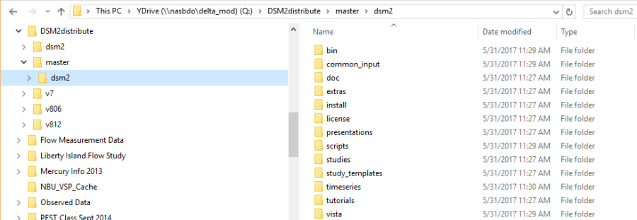
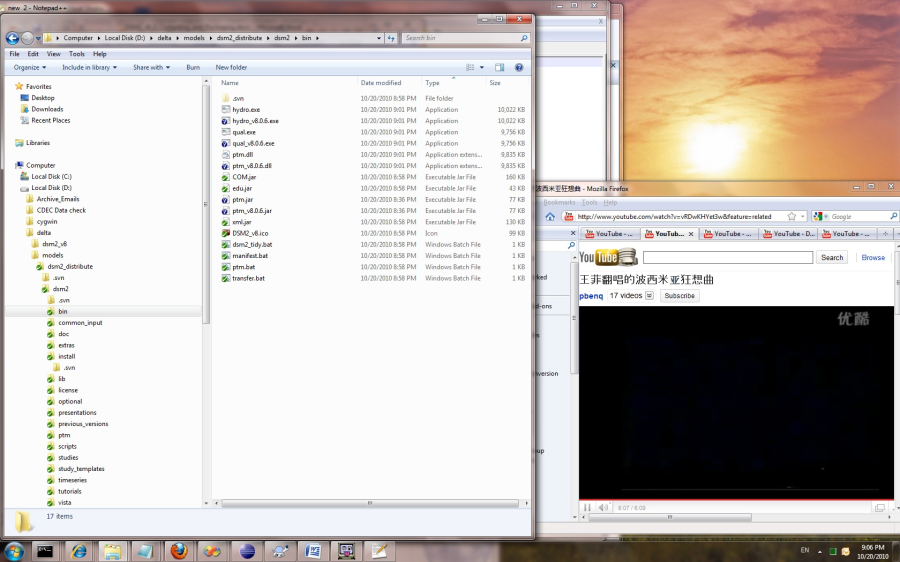
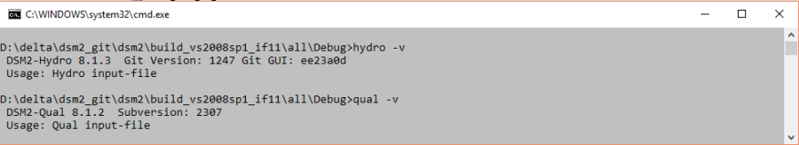
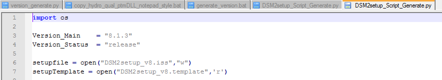
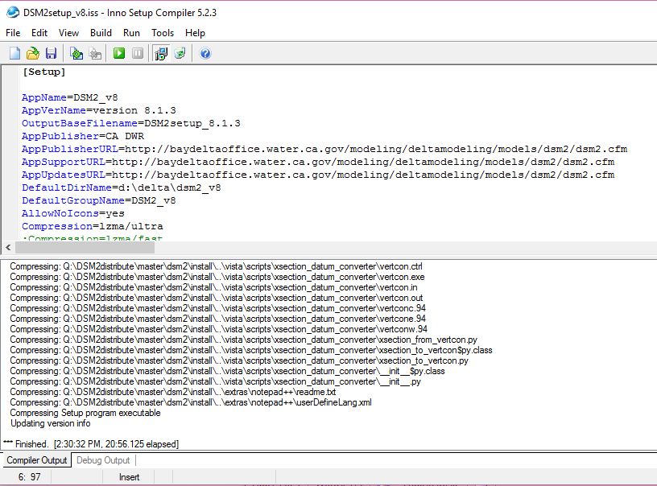

# DSM2 Package

State of CaliforniaDEPARTMENT OF WATER RESOURCESCalifornia Natural
Resources Agency  
**OFFICE MEMO**

<table class="wrapped confluenceTable">
<tbody>
<tr class="odd">
<td class="confluenceTd">
<strong>TO:</strong> 
Nicky Sandhu
</td>
<td class="confluenceTd">
<strong>DATE:</strong>
</td>
<td class="confluenceTd">
May 26 2017
</td>
</tr>
<tr class="even">
<td class="confluenceTd">
 
</td>
<td class="confluenceTd">
<strong>SUBJECT:</strong> 
 
DSM2 package process
</td>
<td class="confluenceTd">
 
</td>
</tr>
<tr class="odd">
<td class="confluenceTd">
<strong>FROM:</strong> 
Yu (Joey) Zhou
</td>
<td class="confluenceTd">
 
</td>
<td class="confluenceTd">
 
</td>
</tr>
</tbody>
</table>

  

# Introduction

  
DSM2 package of data files are placed on DWR-BDO share folder.   
\\\\nasbdo\\delta_mod\\YDrive\\DSM2distribute

\\\\nasbdo\\delta_mod\\YDrive\\DSM2distribute  
It is not version controlled by GIT, but should be tagged (separate
copy) for each release. Any modification is added in the current version
path for the next release.  
\[\\\\nasbdo\\delta_mod\\YDrive{anchor:OLE_LINK10}

DSM2distribute\\master\|\\\\nasbdo\\delta_mod\\YDrive\\DSM2distribute\\master\]

1.  Incorporate DSM2 version-controlled codes

  

1.  Place DSM2 source code (after checkout, compile and exe generation)
    at the same path level as package (red circle in Figure 1)
2.  Place (or replace) dsm2_scripts (after checkout) under dsm2 package
    and modified its name to 'scripts' (green circle in Figure 1)

  
  
Figure 1 Package hierarchy for DSM2 distribution package

1.  Generate tutorial PDF files:

  

1.  Delete all PDF files in
    "..\\DSM2distribute\\master\\dsm2\\tutorials\\pdf"
2.  Run "doc2pdf.vbs" in "..\\DSM2distribute\\master\\dsm2\\install\\"
    to generate PDFs from tutorial word documents.

  

1.  Copy compiled binaries to distribution folder:

  

1.  Check the DSM2 version and paths to the compiled binaries are
    correct in the batch file "copy_hydro_qual_ptmDLL_notepad_style.bat"
    in the folder

..\\ DSM2distribute\\master\\dsm2\\install\\  
Be aware of the version consistence for the 3 control files mentioned in
'DSM2 Versioning'; if not, correct them and re-compile.

1.  Run the batch file "copy_hydro_qual_ptmDLL_notepad_style.bat".

  
  
Figure 2 Executive files transferred to DSM2 distribution package  
Manually copy hydro.exe, qual.exe, ptm.dll, ptm.jar to the folder  
DSM2distribute\\master\\dsm2\\bin\\  
  
Figure 2 Commands used to retrieve the version number (global and
module) of DSM2 sub-modules

1.  Generate packaging script:

  

1.  Check the DSM2 version is correct in the Python script
    "DSM2setup_Script_Generate.py" in the folder
    DSM2distribute\\master\\dsm2\\install\\

Be aware of the version consistence for the 3 control files mentioned in
'DSM2 Versioning'; if not, correct them and re-compile

1.  Run this Python script to generate Inno Setup script
    "DSM2setup_v8.iss". (Figure 6)

  
  
Figure 3 Version control in DSM2 package

1.  +Create DSM2 installation file:+

  
Run "DSM2setup_v8.iss" with Inno Setup Compiler v5.2.3  
The installation file named "DSM2setup_8.X.Xrelease.XXXX.exe" will be
created in the same folder, i.e.
"..\\DSM2distribute\\master\\dsm2\\install"  
  
Figure 4

## Attachments:

[worddav14b25e80eeae77c8d530e1d63cdf3dd9.png](attachments/8323334/8323335.png)
(image/png)  

[worddav8242376d9d4d77860949f429a4c28cc7.png](attachments/8323334/8323336.png)
(image/png)  

[worddavb042dd4352dda38c23db9b477ab8b9a1.png](attachments/8323334/8323337.png)
(image/png)  

[worddav490ef33751ab42acaa896e9bb7dc2dc7.png](attachments/8323334/8323338.png)
(image/png)  

[worddav6978aa4d24279f7d100219d76968d387.png](attachments/8323334/8323339.png)
(image/png)  

