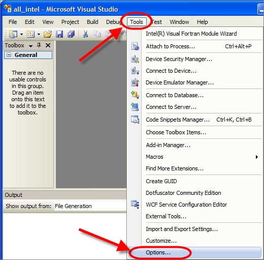
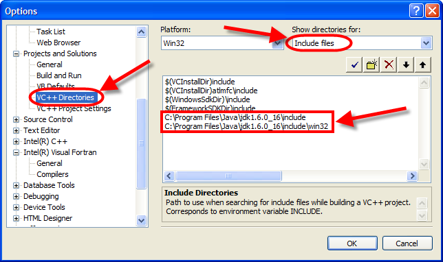
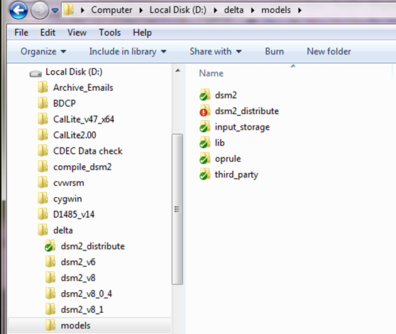
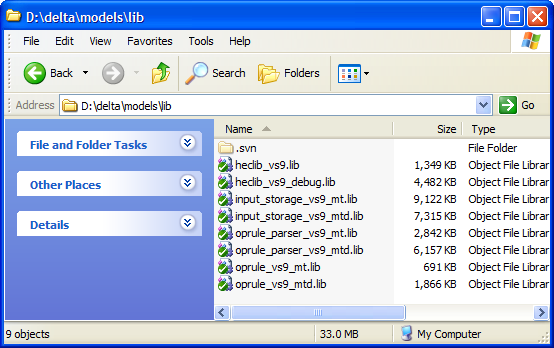
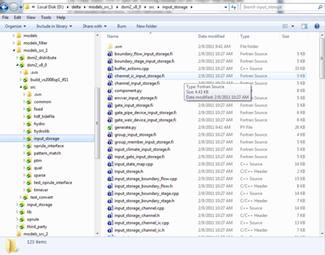
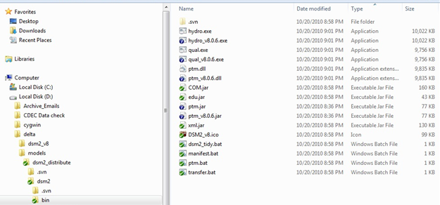
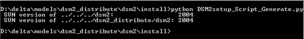
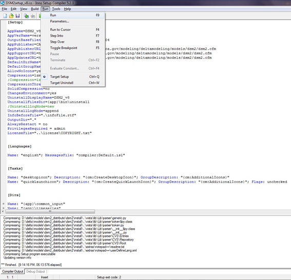

# DSM2 v80 Compiling and Packaging

DSM2 version 80-812 compilation and packaging assuming a minor (bug-fix)
release  
  
This memo presents step-by-step instruction on compiling and packaging
DSM2 version 8 assuming a minor (bug-fix) release. Please note that DSM2
project may be reorganized and moved to an open-source server in the
near future. Please consult with Nicky or Eli or Joey for more
information.

  
 **Required Software**

1.  Visual Studio 2008
2.  Intel Fortran Composer 2013
3.  Subversion <http://subversion.apache.org/packages.html>
4.  Tortoise SVN <http://tortoisesvn.net/downloads>
5.  Flex and Bison packages in Cygwin
    <http://www.cygwin.com/setup.exe>   
    (make sure ../cywin/bin set in the environment path)
6.  Inno Setup Compiler v5.2.3
    <http://files.jrsoftware.org/is/5/isetup-5.2.3.exe>
7.  Python <http://www.python.org/download/>
8.  Java Development Kit
    <http://java.sun.com/javase/downloads/index.jsp>
9.  Microsoft Office 2007
10. Apache ANT http://ant.apache.org/bindownload.cgi

  
Note: make sure all software have their binary, header, or library
folder set in the environment variables.

  
  
**Visual Studio Configurations**

1.  Start Visual Studio 2008, go to "Tools → Options → Projects and
    Solutions → VC++ Directories → Include Files" (See Figure 1)
2.  Add paths to JDK include files (See Figure 2)
3.  Go to the library files: "Tools → Options → Projects and Solutions →
    VC++ Directories → Library Files". Add the fortran library location.
    This will be something like C:\\Program Files
    (x86)\\Intel\\Compiler\\11.1\\065\\lib\\ia32. You should find a file
    ifconsol.lib in this directory.

  
  
**Figure 1**  
  
**Figure 2** 

  

**DSM2 Versioning**  
The latest DSM2 release version is 8.1.3 Subversion: 2309.  
DSM2 is currently on the trunk. Its versioned is 8_1\_\*: the first two
digits of DSM2 version; the 3rd digit is used for minor
(bug-fix) releases. The subversion number is embedded automatically at
compilation time. To modify or increment DSM2 version number, please
confirm that the following 3 files are modified:  
D:\\delta\\models\\dsm2\\src\\common\\version_generate.py  
D:\\delta\\models\\dsm2_distribute\\dsm2\\install\\copy_hydro_qual_ptmDLL_notepad_style.bat  
D:\\delta\\models\\dsm2_distribute\\dsm2\\install\\DSM2setup_Script_Generate.py

\*BDO is using an 'unstable trunk' branching strategy in SVN for DSM2
development.  
\*SVN categories: Trunk is for major development and bug fix; Branches
are usually for separate and time-consuming studies on old versions;
Tags are the records for all release versions.  
\*DSM2 version tag (the 3rd digit in the version number) is
designed to use odd number for internal use, and even number for formal
release 

  

**Checkout DSM2 project**

1\. Checkout the following folders hosted on DWR SVN server and put them
in the same directory, e.g., D:\\delta\\models\\

<http://dminfo:8686/svn/repository/models/trunk/dsm2>  
<http://dminfo:8686/svn/repository/models/trunk/input_storage>  
<http://dminfo:8686/svn/repository/models/trunk/oprule>  
<http://dminfo:8686/svn/repository/models/trunk/dsm2_distribute>  
<http://dminfo:8686/svn/repository/models/trunk/third_party>  
<http://dminfo:8686/svn/repository/models/trunk/lib>

  

2\. Confirm the check-out folders hierarchy and names as following
(Figure 3)

   
**Figure 3** 

  

**Compiling DSM2_v8**

3\. Compile Input_Storage library:

 Use Visual Studio 2008 to open the following solution file and compile
both Debug and Release versions:  
D:\\delta\\models\\input_storage\\build_vs2008\\all\\input_storage_all.sln  
(Before projects Building, make sure generate.py been run, folder ./test
and ./example with their cpp & fi files generated)  
The compiled libraries will be automatically placed in the folder:  
D:\\delta\\models\\lib\\

  

4\. Compile Oprule library:

 Use Visual Studio 2008 to open the following solution file and compile
both Debug and Release versions.  
D:\\delta\\models\\oprule\\build_vs2008\\OpRuleAll.sln  
The compiled libraries will be automatically placed in the folder  
D:\\delta\\models\\lib\\

  

5\. HEC DSS library:

 HEC DSS libraries are precompiled and placed in the folder: (See Figure
4)  
D:\\delta\\models\\lib\\  
The Input_Storage and Oprule libraries are also contained in the folder
(See Figure 4). Compilation steps 3 and 4 are conducted for version
unification, to make sure the libraries are updated.  
  
**Figure 4**

  

6\. Compile DSM2:

a\) Run "generate.py" in the folder
"D:\\delta\\models\\dsm2_v8_1\\src\\input_storage", to generate 121
input storage files. (See Figure 5)

  
   
**Figure 5**

b\) Check the version number is correct (8.1.\*) in the Python script
"version_generate.py" under the folder
"D:\\delta\\models\\dsm2_v8_1\\src\\common".

c\) Do SVN commit and update on the two folders
"D:\\delta\\models\\dsm2_v8_1" and "D:\\delta\\models\\dsm2_distribute".
The Python script "version_generate.py " under the folder
"D:\\delta\\models\\dsm2\\src\\common" will be called automatically at
compilation time to embed SVN version number into "version.inc"

d\) Open the solution file
"D:\\delta\\models\\dsm2_v8_0\\build_vs2008sp1_if11\\all" with Visual
Studio 2008 and compile using Rebuild Solution with Release version.

e\) Double check that the svn subversion in version.fi is a single
number (eg. "1945"), not something with a colon or letter in it
(1940:1941 or 1942M). If you do have these, it means you either haven't
committed or updated thoroughly.

f\) The release version of compiled binaries will be automatically
placed in the folders:

D:\\delta\\models\\dsm2_v8_1\\build_vs2008sp1_if11\\all\\Release (hydro
and qual.exe)
D:\\delta\\models\\dsm2_v8_1\\build_vs2008sp1_if11\\all\\DLL (ptm.dll)

g\) The major part of PTM module is written in Java programming language
and placed in the source code folder:

D:\\delta\\models\\dsm2_v8_1\\src\\ptm  
The default PTM Java compiling procedure is set in build.xml; open the
command window and run 'ant' (build.xml as default running file) at
current folder. The release version of compiled application file will be
automatically placed in the folder:  
D:\\delta\\models\\dsm2_v8_0\\src\\ptm\\lib (ptm.jar)  
  
**Packaging DSM2**

1\. Generate tutorial PDF files:

a\) Delete all PDF files in
"D:\\delta\\models\\dsm2_distribute\\dsm2\\tutorials\\pdf"

b\) Run "doc2pdf.vbs" in
"D:\\delta\\models\\dsm2_distribute\\dsm2\\install\\" to generate PDFs
from tutorial word documents.

  

2\. Copy compiled binaries to distribution folder:

a\) Check the DSM2 version and paths to the compiled binaries are
correct in the batch file "copy_hydro_qual_ptmDLL_notepad_style.bat" in
the folder D:\\delta\\models\\dsm2_distribute\\dsm2\\install\\

Be aware of the version consistence for the 3 control files mentioned in
'DSM2 Versioning'; if not, correct them and re-compile from 6-4 in the
previous section

b\) Run the batch file "copy_hydro_qual_ptmDLL_notepad_style.bat".

  
   
**Figure 5**  
Manually copy hydro.exe, qual.exe, ptm.dll, ptm.jar to the folder  
D:\\delta\\models\\dsm2_distribute\\dsm2\\bin

  

3\. Generate packaging script:

a\) Check the DSM2 version is correct in the Python script
"DSM2setup_Script_Generate.py" in the folder
D:\\delta\\models\\dsm2_distribute\\dsm2\\install\\

Be aware of the version consistence for the 3 control files mentioned in
'DSM2 Versioning'; if not, correct them and re-compile from 6-4 in the
previous section

b\) Run this Python script to generate Inno Setup script
"DSM2setup_v8.iss". (Figure 6)

  
   
**Figure 6**

  

4\. Create DSM2 installation file:+

 Run "DSM2setup_v8.iss" with Inno Setup Compiler v5.2.3  
The installation file named "DSM2setup_8.X.Xrelease.XXXX.exe" will be
created in the same folder, i.e.,
"D:\\delta\\models\\dsm2_distribute\\dsm2\\install"  
   
**Figure 7**

  

5\. Quick-test installer:

Test installation on clean machine. Run historical hydro, qual_ec and
ptm.

  

6\. SVN Tag and version increment:

Create SVN release tag for both "dsm2" and "dsm2_distribute" folders.
(See Figure 5).  
Immediately increment DSM2 version number in the following three
files:  
D:\\delta\\models\\dsm2\\src\\common\\version_generate.py  
D:\\delta\\models\\dsm2_distribute\\dsm2\\install\\copy_hydro_qual_ptmDLL_notepad_style.bat  
D:\\delta\\models\\dsm2_distribute\\dsm2\\install\\DSM2setup_Script_Generate.py  
  
  
**Figure 8**

## Attachments:

[image2017-6-13_15-47-59.png](attachments/8323293/8323294.png)
(image/png)  

[image2017-6-13_15-47-43.png](attachments/8323293/8323295.png)
(image/png)  

[image2017-6-13_15-47-35.png](attachments/8323293/8323296.png)
(image/png)  

[image2017-6-13_15-47-17.png](attachments/8323293/8323297.png)
(image/png)  

[image2017-6-13_15-46-58.png](attachments/8323293/8323298.png)
(image/png)  

[worddav07c1c902559a15d9cb8d941d966322cb.png](attachments/8323293/8323299.png)
(image/png)  

[worddavb0ec1d6cc7478dc4ec73bc27abb42880.png](attachments/8323293/8323300.png)
(image/png)  

[worddav0037c3b8067a8dd0d52094029690277b.png](attachments/8323293/8323301.png)
(image/png)  

[worddav490ef33751ab42acaa896e9bb7dc2dc7.png](attachments/8323293/8323302.png)
(image/png)  

[worddav73b529f2e3382f4bb77f505185a10945.png](attachments/8323293/8323303.png)
(image/png)  

[worddavc7e39738a4a8caa213b31d248d81f87b.png](attachments/8323293/8323304.png)
(image/png)  

[worddavb58034debe15b3d2514f722580c782ad.png](attachments/8323293/8323305.png)
(image/png)  

[worddav1c1324ef8177e0822bb62d9cdf8fdb05.png](attachments/8323293/8323306.png)
(image/png)  

[worddava9503121f9ac50fd0060de1b95c6decc.png](attachments/8323293/8323307.png)
(image/png)  

