# DSM2_v8_0\_PTM_Compiling_eclipse

Date: 9/10/2010  
To: Tara Smith  
Cc: Min Yu, Kijin Knam  
From: Yu Zhou  
Delta Modeling Section  
Bay-Delta Office  
Department of Water Resources  
Subject:DSM2 version 8 PTM editing, compilation and packaging  
This memo presents step-by-step instruction on establishing editable
project, compiling and packaging DSM2 (version 8) PTM module in Eclipse.
Note this is the version for PTM source code editing purpose. The
version for straight compiling is in the DSM2 compiling memo:
DSM2_v8_0\_Compiling_and_Packaging.  
  
**Required Software and Source Code Check out**  

1.  Java Development Kit
    <http://java.sun.com/javase/downloads/index.jsp>
2.  Eclipse-jee-galileo-win32
    +http://www.eclipse.org/downloads/packages/release/galileo/sr2+
3.  PTM Java source code are checked out in the DSM2 Compile & Package
    document, with the whole DSM2 coding package:

The specific folder directory on DWR SVN server is:  
+http://dminfo.water.ca.gov:8686/svn/repository/models/branches/dsm2_v8_0/src/ptm/DWR/DMS/PTM+  
and could be put at following directory on local computers:  
+D:\\delta\\models\\dsm2_v8_0\\src\\ptm+  
  
**Build up project**  
**Method 1: with Eclipse project description file**  
File -\> Import -\> Existing Projects into Workspace -\> Next -\> Select
root directory (Browse) to where .project resides -\> Ok -\> Finish  
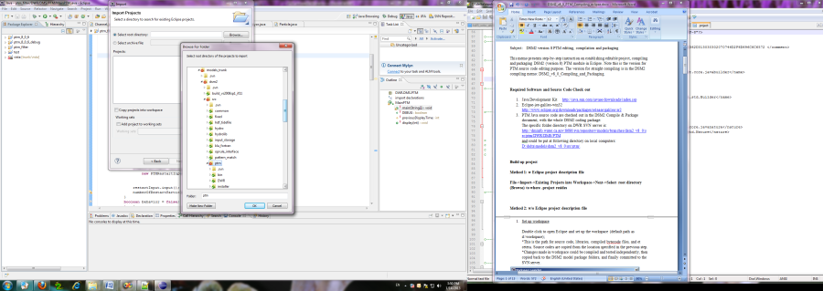  
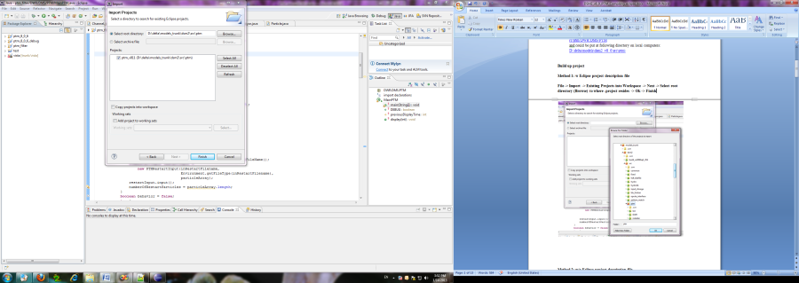  
  
  
  
**Method 2: w/o Eclipse project description file**  

1.  Set up workspace

  
Double click to open Eclipse and set up the workspace (default path as
d:\\workspace);  
\*This is the path for source code, libraries, compiled bytecode files,
and et cetera. Source codes are copied from the location specified in
the previous step.  
\*Changes made in workspace could be compiled and tested independently,
then copied back to the DSM2 model package folders, and finally
committed to the SVN server.  
  

1.  Create the PTM project in workspace

  
File-\>New-\>Java Project  
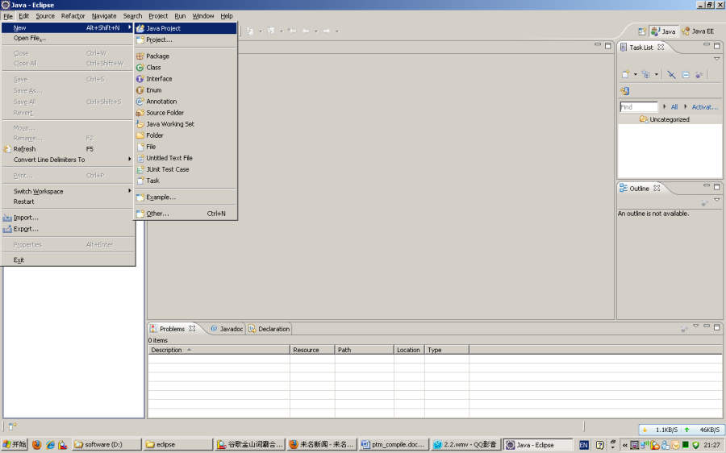  
'Project name' input e.g. ptm  
'Project layout' select as 'Use project folder as root for sources and
class files' (with src and bytecode stored at one place; the other
option is also ok for use)  
  
Next-\>Libraries-\>Add External JARs-\>Select 3 jar files (COM.jar,
edu.jar, xml.jar) at directory:  
D:\\delta\\models\\dsm2_v8_0\\src\\ptm\\lib  
Finish  
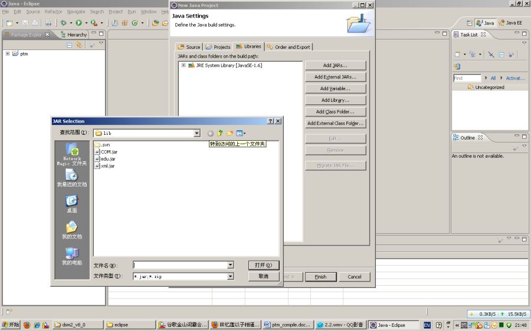  

1.  Create Package to include source codes:

  
Right click ptm in the Package Explorer-\>New-\>Package  
  
Input Package Name under Source folder ptm: DWR.DMS.PTM  
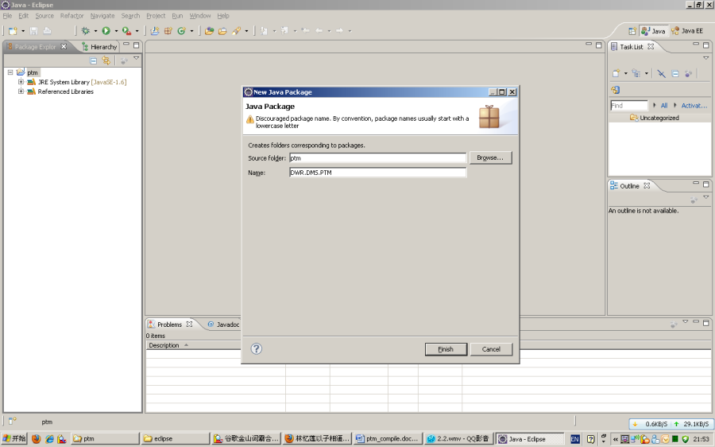  
Import java source codes  
  
General-\>File System-\>Next  
From directory-\>Browse (DSM2 PTM Java src folders) -\>OK  
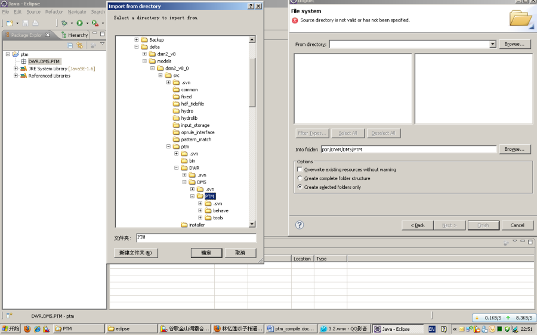  
Check PTM box on the left window (to include all the java
files)-\>Finish  
  
\*Eclipse would automatically create 2 packages for the sub-folders:  
DWR.DMS.PTM.behave  
DWR.DMS.PTM.tools  
\*If some error msg like 'access restriction' comes out: Try to remove
the JRE System library from Project ptm-\>Properties-\>Java Build
Path-\>Libraries, and add it again  
**Compile** **and debug PTM**  

1.  Compile source code to bytecode

  
Project-\>Build Project  
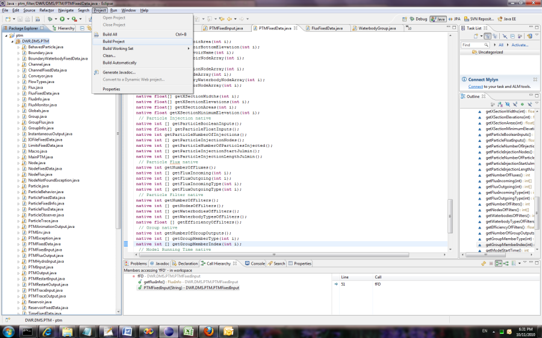  
Bytecodes (**.class) are stored at the same place as source codes
(**.java)  
Automatic compilation could be enabled by Project -\> Build
Automatically  

1.  Run/Debug Variables Configuration

  
Set up the PTM input study file in IDE configuration  
Menu Run/Debug-\> Run/Debug Configuration  
  
Java Application-\>New  
  
e.g.  
Main Tab:  
Name: MainPTM  
Main Class: DWR.DMS.PTM.MainPTM  
Argument Tab:  
Program arguments: historical_ptm.inp (the sample PTM input file in a
DSM2 v8 historical study; make sure the hydro file has been run first
and h5 file exists)  
VM arguments: -ss1m -mx512m -oss1m  
Other: D:\\delta\\dsm2_v8\\study_templates\\historical  
Environment Tab:  
DSM2_HOME d:\\delta\\dsm2_v8  
Path d:\\delta\\dsm2_v8\\bin  
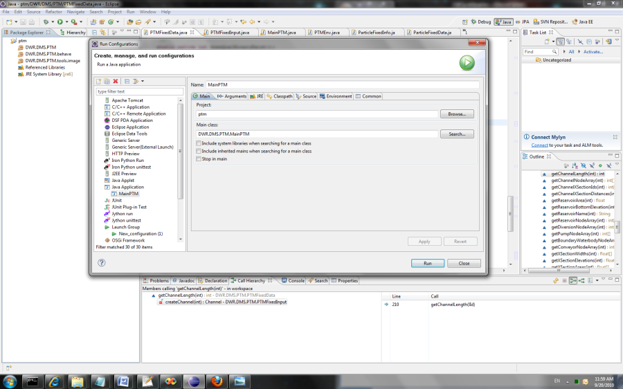  
  
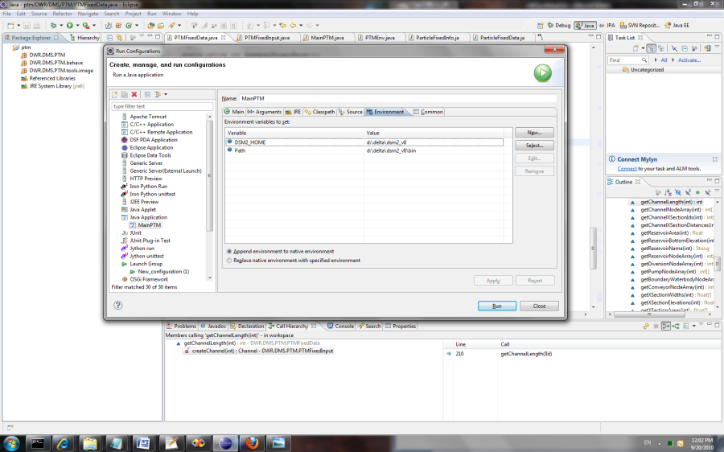  

1.  Run/Debug PTM

  
Switch to Debug Mode, which enable breakpoint setting and variable
tracking  
Run-\>Run/Debug MainPTM for calculation checking  
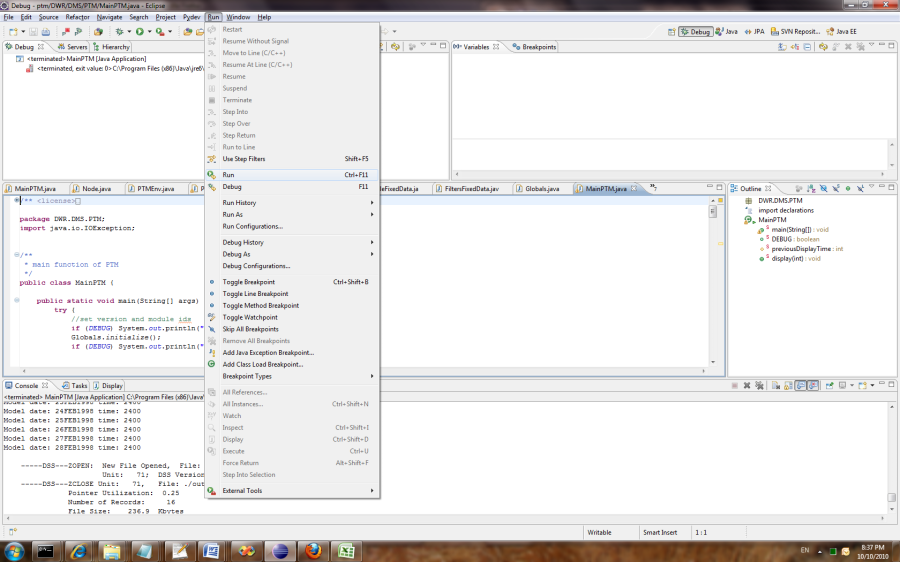  
  
**Export back to DSM2 package**

1.  Combine the PTM Java bytecotes and related libraries into a JAR file

  
File-\>Export-\>Java-\>JAR file  
  
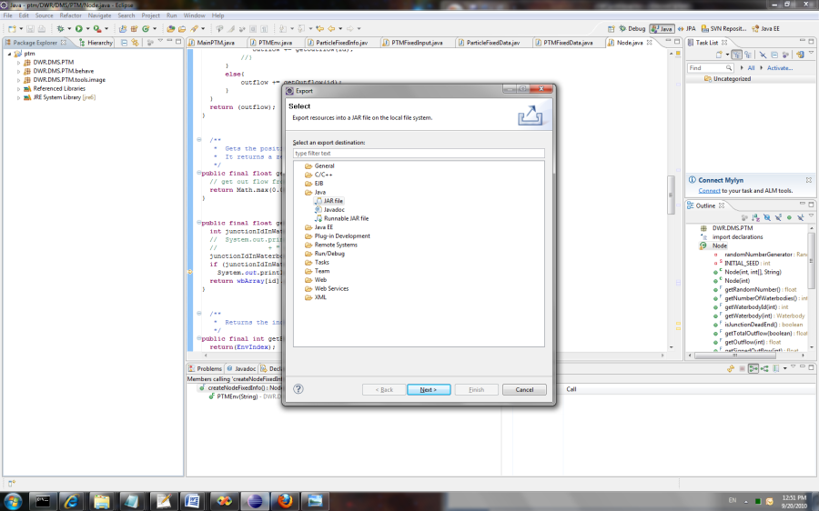  
Check ptm box on the left to select all the bytecode files and
libraries  
Select the export destination: D:\\workspace\\ptm\\ptm.jar  
  

1.  Copy the JAR file to the DSM2 distribution binary folder for
    packaging:

+D:\\delta\\models\\dsm2_distribute\\dsm2\\ptm\\lib+  
Other PTM related files, e.g. ptm.dll, are compiled in related C++ and
Fortran projects of DSM2 Visual Studio solution. Please see the document
for details.

## Attachments:

[worddav44179cfae725fe5f39c7b918214b4d68.png](attachments/8323308/8323309.png)
(image/png)  

[worddav21d73a7e0e593bfd3b0107605d9a879c.png](attachments/8323308/8323310.png)
(image/png)  

[worddave3944aea30dfda849398f8b2d35e5ca0.png](attachments/8323308/8323311.png)
(image/png)  

[worddav166bb58986798c0c19da41ec64557bc5.png](attachments/8323308/8323312.png)
(image/png)  

[worddav0e06297fcdac03d480d52d4303a8f664.png](attachments/8323308/8323313.png)
(image/png)  

[worddav974c8dfc9bac21524c2e729c9ddf7938.png](attachments/8323308/8323314.png)
(image/png)  

[worddav4acaef0242e743933e42a19aac4be497.png](attachments/8323308/8323315.png)
(image/png)  

[worddava8b154265c7f02598531839e7c2691d2.png](attachments/8323308/8323316.png)
(image/png)  

[worddav92a273d21de65a713f3c72c11cdd9d2f.png](attachments/8323308/8323317.png)
(image/png)  

[worddavca883dcc4d073032cba8861c22f82023.png](attachments/8323308/8323318.png)
(image/png)  

[worddav6787134635058c6f17e54d0d92dfbceb.png](attachments/8323308/8323319.png)
(image/png)  

[worddava5ae1f4d3a3483dc4320496d098a0bc6.png](attachments/8323308/8323320.png)
(image/png)  

[worddav7728359a07b9c4738d8f2fc9e1dcbe00.png](attachments/8323308/8323321.png)
(image/png)  

[worddavba79a0a41e348cbfbb98c6c379e69d73.png](attachments/8323308/8323322.png)
(image/png)  

[worddavaa8687d7165c7477fa2fe14970938e00.png](attachments/8323308/8323323.png)
(image/png)  

[worddav0497cdcda22d3ff9a889885b64ed225a.png](attachments/8323308/8323324.png)
(image/png)  

[worddav911bf0d4648403b4cd5c945075026a73.png](attachments/8323308/8323325.png)
(image/png)  

[worddav7a2f929ee2f765ed2f7e2f8c617f4e9a.png](attachments/8323308/8323326.png)
(image/png)  

[worddavd39e409d006ca7cd1fececf0ba72f5d5.png](attachments/8323308/8323327.png)
(image/png)  

[worddaveec0e1cc149a8a2c30bf9d635c413987.png](attachments/8323308/8323328.png)
(image/png)  

[worddav769c68dd95f5a8d049cd75682818d784.png](attachments/8323308/8323329.png)
(image/png)  

